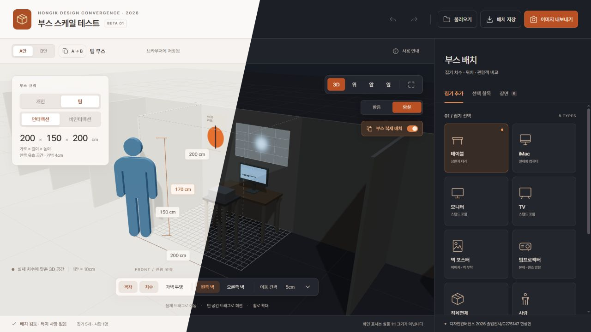

# Booth Scale Test

[Open the web app](https://sangheon-han.github.io/hongik-booth-scale-test/)

A 3D booth planner for the Interaction class of Hongik University's 2026 Design Convergence graduation exhibition. Arrange furniture, screens, posters, and projection areas at real-world proportions. The interface is in Korean.

## Run locally

Install Node.js, then run:

```sh
npm ci
npm run dev
```

Open http://127.0.0.1:4310/. Do not open `index.html` directly. The first dependency installation needs internet access; the app runs without external fonts, images, or CDNs afterward. Use a supported Node.js LTS version (20.19+ or 22.12+).

### Windows

Double-click `실행.cmd` to build and open a local preview.

### macOS

Install Node.js LTS, then double-click `실행.command`. The launcher installs missing dependencies, builds the app, starts a local server and opens your default browser. Keep its Terminal window open while using the app; press **Ctrl+C** to stop the server. Launching it again reuses the running server.

If an extracted ZIP does not preserve execution permissions, open Terminal in the project folder and run:

```sh
chmod +x ./실행.command
./실행.command
```

You can also run `bash ./실행.command` from that folder. The same files work with Apple Silicon and Intel Macs when using a compatible Node.js installation. macOS may ask you to approve opening a downloaded script. Local browser layouts stay at `http://127.0.0.1:4310/`; switching to the hosted website does not automatically transfer them, so use JSON export/import.

```sh
npm test          # Geometry, layouts, migration, and lighting checks
npm run build    # Static output in dist/
npm run preview  # Serve the build locally
```

No account or backend is required. Layouts and uploaded poster images stay in your browser unless you export and share them.

## Web deployment

GitHub Pages serves the static app built from `main`. The workflow in `.github/workflows/deploy.yml` installs dependencies, runs tests, checks the launcher on macOS, builds, and deploys `dist/`. In repository **Settings → Pages**, select **GitHub Actions** as the source. Relative asset URLs support project subpaths and forks without changing the build configuration.

## Features

- Individual/team width: **150/200 cm**. Interaction/non-interaction depth: **150/100 cm**. Height: **200 cm**. Changing the booth preserves object sizes and positions.
- Tables, iMacs, monitors, TVs, projectors, boxes, people, and wall posters with editable dimensions. Presets are examples, not verified product specifications.
- Drag objects or enter their position and rotation. Equipment attached to a table follows its position, rotation, and height. Click empty space to clear the selection; direction guides do not select objects.
- Independent left/right wall toggles, with a separate wall transparency control. Walls default to 4 cm thick and sit outside the usable floor area.
- A continuous exhibition floor extends through the booth and aisle. **부스 복제 배치** adds three empty personal Interaction booths on each side (150 × 150 × 200 cm); **전체 보기** frames the row. These are visual context, not editable items or a reconstruction of the actual exhibition plan. The main booth's wall toggles still control its side partitions. The toggle is saved independently in A/B layouts.
- **A/B layouts** with independent names, objects, images, walls, and lighting. Opening B for the first time copies A. Switching preserves the camera. Copying over an existing layout asks for confirmation and can be undone.
- **Bright / Dark room** modes. Screens emit on their front side and cast a soft, forward-facing light that follows their rotation. Dark mode dims the room and grid guides and switches the entire interface to a dark theme with orange accents. Bright mode restores the light interface.
- Editable projector distance, throw ratio, aspect ratio, vertical angle, vertical shift, intensity, and **light color**. Light color affects the beam, projected area, lens glow, and local illumination independently of body color.

## Posters

Add a wall poster, choose a back/left/right wall, and upload a PNG, JPEG, or WebP image up to 10 MB. Set its width, height, horizontal wall position, and bottom height above the floor. Dragging follows the wall. Turning a wall off also hides its posters.

Images are compressed to JPEG with a maximum long edge of 1400 px and embedded in the saved layout. Transparent areas become white. The initial height follows the image ratio; the aspect-fit button restores it after manual resizing.

## Projection and lighting

Projected width = **distance / throw ratio**. Screen height follows the selected aspect ratio.

| Control | Range |
| --- | --- |
| Distance | 10–1000 cm |
| Throw ratio | 0.2–4 |
| Aspect ratio | 16:9, 4:3, 1:1 |
| Vertical angle | −60° to +60° |
| Vertical shift | −1 to +1 screen heights |
| Light intensity | 0–2, relative visual strength |
| Light color | Any RGB color |

Rotate the projector body to change horizontal direction. **Fit to back wall** turns on the wall and sets direction, distance, and vertical angle from the current position. Vertical shift is preserved. Use it again after moving the projector.

Projection uses a virtual screen at the chosen distance. Projector occlusion, keystone correction, focus, and measured illuminance are not simulated. Screen lights use forward-facing cones with shadows. Up to eight active devices cast auxiliary light. These effects support layout review, not photometric analysis.

Load [the poster and lighting example](./examples/lighting-and-posters.json) to compare a bright poster layout with a dark projector layout. Its poster image is embedded.

## Controls

| Action | Result |
| --- | --- |
| Drag an object | Move horizontally in 3D/top view; vertically in front/side view |
| Drag a poster | Move along its wall |
| Drag empty space | Orbit in 3D |
| Mouse wheel / right-button drag | Zoom / pan |
| Top / front / side | Orthographic views |
| Fit view | Restore the default framing |
| Ctrl+Z / Ctrl+Shift+Z | Undo / redo |
| Ctrl+D / Delete / Esc | Duplicate / delete / deselect |

Inputs are in centimetres. Object positions use the bottom centre: X is horizontal, Y is height, and positive Z faces the audience. The person ruler measures feet to head; width and thickness are symbolic, not ergonomic measurements. The on-screen image is not physically life-size.

## Save and share layouts

Both layouts save automatically in the browser. Export JSON to move them between computers or browser addresses. It contains the active layout, A/B scenes, images, object poses, table attachments, wall settings, projection colors/settings, and lighting. PNG exports the active view.

Older v1/v2 scenes load into A with compatible defaults. Older v3 projectors without a light color receive the original pale blue. Custom names, positions, and attachments are preserved. Camera position and selection are not saved.

Each layout supports 100 objects, including up to eight posters. JSON imports are limited to 12 MB. If images exceed browser storage, the app shows a warning: export JSON to keep your work. Boundary and overlap messages are approximate checks and do not restrict placement.

## Make it your own

Feel free to use, modify, fork, and redistribute this project. Edit it directly or ask an AI coding agent to help. [AGENTS.md](./AGENTS.md) explains the file structure and how to add object types.

Released under the [MIT License](./LICENSE). A small credit to the original author when sharing your version would be appreciated. Please keep the included copyright and license notices. Dependencies retain their own licenses.

## Credit

**Sangheon Han (한상헌)** — Design Convergence, Hongik University  
[charlotte@g.hongik.ac.kr](mailto:charlotte@g.hongik.ac.kr)
